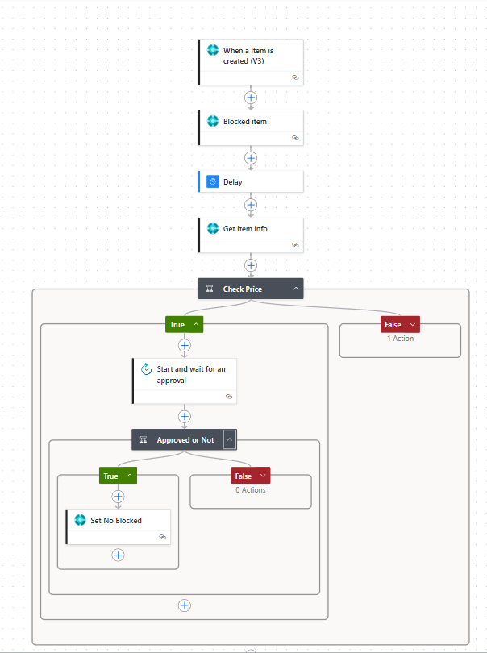
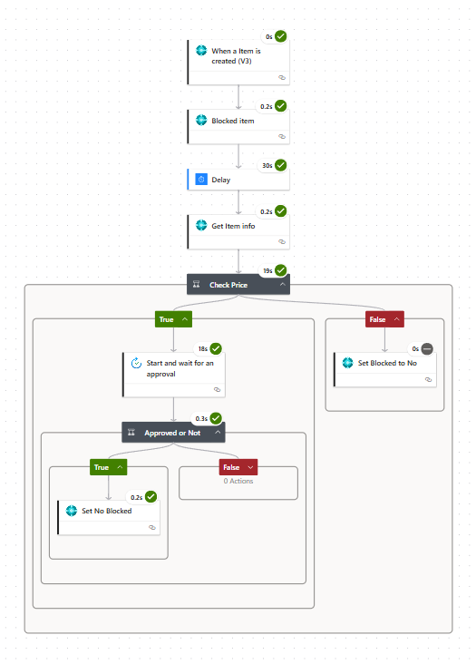

# 📦 Inventory Item Approval Flow – Power Automate

## 🧠 Purpose
This flow is designed to **block high-value items until approved**. When a new item is created, the flow checks the item price. If it exceeds a threshold, the item remains blocked until a manager approves it.

## ⚙️ Trigger
- **When an item is created (V3)** – Triggered on a new item record (Dataverse or SharePoint)

## 🧩 Flow Steps
1. **Blocked item** – Sets item as "Blocked = true"
2. **Delay** – Waits briefly (e.g., 30 sec) to ensure system writes complete
3. **Get item info** – Retrieves the item's price or metadata
4. **Check Price** – If price > $X threshold:
   - Send approval request
   - If approved ➜ unblock the item (`Set No Blocked = true`)
   - If rejected ➜ keep blocked
5. If price does **not** exceed threshold, no action is taken

## 📷 Screenshots

## 🔗 Technologies Used
- Power Automate Cloud Flow
- Approval connector
- Conditional branching
- Update item action

## 🗂 Notes
- Designed for use with inventory workflows (BC/F&O/SharePoint)
- Can be extended with email notifications and audit logging
- Can be used for any other Approval Flow

